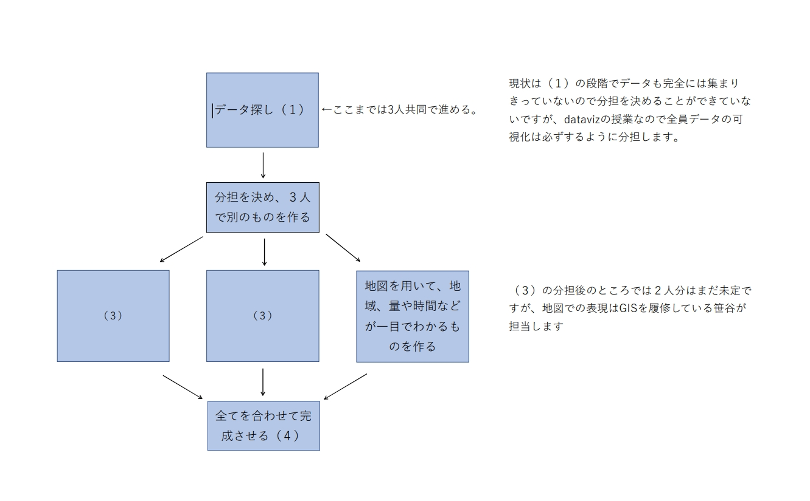

## 紹介文

### ・リサーチクエスチョンの紹介
幸福ランキング中間くらいの日本のライフワークバランスについて

### ・それがなぜ重要なのか、何が問題になっているのかについての説明
日本は海外に比べ、労働時間が長い。そのことが国民の健康や幸福に大きく影響を与えている可能性があるため。

### ・使用するデータソース（最低２個）の予備的かつ最終的な説明
　以下のデータに含まれる幸福度やそれに関連するのデータと残業時間等の仕事に関わるデータの要素を組み合わせて日本の現状の問題を探したい。

①「OpenWork 残業と有給　10年の変化」働きがい研究所
→日本の残業時間に関するデータ
https://www.vorkers.com/hatarakigai/vol_91

②「World Happiness Report 2023」WR
→世界の幸福度に関するランキングやデータ
https://worldhappiness.report

### ・プロジェクトの目的の分析とその結果の可視化の方法論を説明する視覚的なフローチャートを伴う説明

### ・研究からどのような洞察が得られると期待されるのかについての結論の段落
　日本人は仕事の時間が長く、自分の時間を確保できないため、心身ともに悪影響があり、幸福度にも悪影響が出ていると推測している。
　余裕があれば、どうすれば改善できそうかというところまで書きたい。